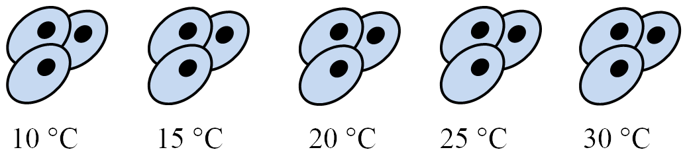

<!-- The file analysis/chunks.R contains chunks that define default settings
shared across the workflowr files. -->
```{r read-chunk, include=FALSE, cache=FALSE}
knitr::read_chunk("chunks.R")
```

<!-- Update knitr chunk options -->
```{r knitr-opts-chunk, include=FALSE}
```

<!-- Insert the date the file was last updated -->
```{r last-updated, echo=FALSE, results='asis'}
```

<!-- Insert the code version (Git commit SHA1) if Git repository exists and R
 package git2r is installed -->
```{r code-version, echo=FALSE, results='asis'}
```

Cover the basics of the biology and the statistics.

```{r setup}
gexp <- readRDS("../data/ch01.rds")
stats <- readRDS("../data/ch01-stats.rds")
```

## What is differential expression? (Video)

Describe a simple model of gene regulation (transcription factors, DNA, RNA,
protein) and the functional genomics technologies used to measure the various
features. Focus on the type of data they return (continuous vs. discrete).

## Functional genomics technologies (MultipleChoiceExercise)

Choose which is true. The options will be various combinations of genomics
technologies, what they measure, and the type of data they return. For example,
"Microarrays measure RNA levels and return continuous data. ChIP-seq measures
transcription factor binding to DNA and returns discrete data." is true.

## Visualize one differentially expressed gene

Visualize one differentially expressed gene with boxplots (geom_boxplot).

```{r}
index <- which(stats$labels_pre == "DE-up; low-var" & stats$labels == "DE")[1]
library("dplyr")
library("tidyr")
library("stringr")
single_gene <- gexp %>% as.data.frame %>%
  slice(index) %>%
  gather(key = "group", value = "gene") %>%
  mutate(group = str_extract(group, "[a-z]*")) %>%
  as.data.frame()
```

```{r}
library("ggplot2")

head(single_gene)

ggplot(single_gene, aes(x = group, y = gene)) +
  geom_boxplot()
```

## Visualize many differentially expressed genes

Visualize many differentially expressed genes with a heatmap (stats::heatmap).

```{r}
# Check the dimensions
dim(gexp)

# View the first few rows
head(gexp)

# Plot a heatmap
heatmap(gexp)
```

## What is a linear model? (Video)

Review the basics of multiple linear regression (dependent vs independent
variables, continuous vs discrete covariates, intercept term, error term).
Demonstrate how to specify equations in R (e.g. `lm` and `model.matrix`).

```{r}
library("dplyr")
library("ggplot2")
df_vis <- data.frame(status = rep(c("con", "treat"), each = 50)) %>%
  mutate(gene_de = c(rpois(n() / 2, lambda = 12), rpois(n() / 2, lambda = 30)),
         gene_var =c(rpois(n() / 2, lambda = 15) + rnorm(n() / 2, sd = 10),
                     rpois(n() / 2, lambda = 25) + rnorm(n() / 2, sd = 10)))
ggplot(df_vis, aes(x = status, y = gene_de)) +
  geom_boxplot() +
  theme_classic(base_size = 16) +
  ylim(0, 40) +
  labs(x = "Treatment status", y = "Gene expression level")
ggsave("../figure/ch01/gene-de.png", width = 5, height = 6)
ggplot(df_vis, aes(x = status, y = gene_var)) +
  geom_boxplot() +
  theme_classic(base_size = 16) +
  ylim(0, 40) +
  labs(x = "Treatment status", y = "Gene expression level")
ggsave("../figure/ch01/gene-ambiguous.png", width = 5, height = 6)
```


**Transcript:** As you just visualized, differential expression describes the
situation in which a gene has a different mean expression level between
conditions. While some gene expression patterns are easily diagnosed as
differential expression or not from a quick visualization, you also saw some
examples that were more ambiguous. Furthermore, you need a method that is more
robust than a quick visual inspection and also scales to thousands of genes. For
this you will use the tools of statistical inference to determine if the
difference in mean expression level is larger than that expected by chance.
Specifically, you will use linear models to perform the hypothesis tests. Linear
models are an ideal choice for genomics experiments because their flexibility
and robustness to assumptions allow you to conveniently model data from various
study designs and data sources.

You should have already been introduced to linear models, for example in a
DataCamp course such as Correlation and Regression, or in an introductory
statistics course. Here I'll review the terminology we will use in the remainder
of the course, how to specify a linear model in R, and the intuition behind
linear models.



$$ Y =  \beta_0 + \beta_1 X_1 + \epsilon $$

In this equation of a linear model, Y is the response variable. It must be a
continuous variable. In the context of differential expression, it is a relative
measure of either RNA or protein expression level for one gene. $X_1$ is an
explanatory variable, which can be continuous or discrete, for example, control
group versus treatment, or mutant versus wild type. $\beta_1$ quantifies the
effect of the explanatory variable on the response variable. Furthermore, we can
add additional explanatory variables to the equation for more complicated
experimental designs. Lastly, \epsilon models the random noise in the
measurements.

In R, you specify a linear model with the function `lm`. This uses R's formula
syntax. On the left is the object that contains the response variable, and to
the right of the tilde are the objects that contain the explanatory variables.

```{r eval=FALSE}
lm(y ~ x1)
```

A second explanatory variable can be added with a plus sign.

$$ Y =  \beta_0 + \beta_1 X_1 + \beta_2 X_2 + \epsilon $$

```{r eval=FALSE}
lm(y ~ x1 + x2)
```

Building some intuition.

```{r inuition, fig.width = 10, fig.height = 5, message=FALSE}
library("broom")
library("cowplot")
library("dplyr")
library("ggplot2")
theme_set(theme_classic(base_size = 16))

# Simulate a linear regression.
#
# n = sample size
# effect = slope
# error = standard deviation of distribution of residuals
# seed = seed for random number generator
#
# Returns a data.frame with the following columns:
#
# x          Explanatory variable
# y          Response variable
# y_bar      Mean of response variable
# intercept  Intercept of least squares regression line
# slope      Slope of least squares regression line
# y_hat      Fitted values
# fstat      F-statistic
# ss_exp     Explained sum of squares
# ss_res     Residual sum of squares (noise)
sim_lm <- function(n, effect, error, seed = 1) {
  stopifnot(is.numeric(n), n > 0, length(n) == 1)
  stopifnot(is.numeric(effect), length(effect) == 1)
  stopifnot(is.numeric(error), error > 0, length(error) == 1)
  stopifnot(is.numeric(seed), length(seed) == 1)
  
  set.seed(seed)
  x = runif(n, min = -25, max = 25)
  y = x * effect + rnorm(n, sd = error)
  y_bar = mean(y)
  mod <- lm(y ~ x)
  coefs <- coef(mod)
  intercept <- coefs[1]
  slope <- coefs[2]
  y_hat = fitted(mod)
  anova_tidy <- tidy(anova(mod))
  fstat <- anova_tidy$statistic[1]
  ss <- anova_tidy$sumsq
  ss_exp <- ss[1]
  ss_res <- ss[2]
  stopifnot(ss_exp - sum((y_hat - y_bar)^2) < 0.01)
  stopifnot(ss_res - sum(residuals(mod)^2) < 0.01)
  return(data.frame(x, y, y_bar, intercept, slope, y_hat, fstat, ss_exp, ss_res,
                    row.names = 1:n))
}

# Visualize the residual sum of squares
plot_ss_res <- function(d) {
  ggplot(d, aes(x = x, y = y)) +
    geom_point() +
    geom_abline(aes(intercept = intercept, slope = slope)) +
    geom_linerange(aes(ymin = y, ymax = y_hat), color = "red",
                   linetype = "dashed") +
    geom_text(aes(x = quantile(x, 0.25), y = quantile(y, 0.75),
                  label = round(ss_res, 2)), color = "red") +
    labs(title = "Residual sum of squares (noise)") +
    ylim(-60, 60)
}

# Visualize the explained sum of squares
plot_ss_exp <- function(d) {
  ggplot(d, aes(x = x, y = y)) +
    geom_abline(aes(intercept = intercept, slope = slope)) +
    geom_hline(aes(yintercept = y_bar)) +
    geom_linerange(aes(ymin = y_hat, ymax = y_bar), color = "blue",
                   linetype = "dashed") +
    geom_text(aes(x = quantile(x, 0.25), y = quantile(y, 0.75),
                  label = round(ss_exp, 2)), color = "blue") +
    labs(title = "Explained sum of squares") +
    ylim(-60, 60)
}

# baseline
baseline <- sim_lm(n = 10, effect = 2, error = 5)
baseline_ss_res <- plot_ss_res(baseline)
dir.create("../figure/ch01/", recursive = TRUE, showWarnings = FALSE)
ggsave("../figure/ch01/baseline_ss_res.png", baseline_ss_res, width = 5, height = 6)
baseline_ss_exp <- plot_ss_exp(baseline)
ggsave("../figure/ch01/baseline_ss_exp.png", baseline_ss_exp, width = 5, height = 6)
plot_grid(baseline_ss_res, baseline_ss_exp)
baseline$fstat[1]

# Increased error
more_error <- sim_lm(n = 10, effect = 2, error = 10)
more_error_ss_res <- plot_ss_res(more_error)
dir.create("../figure/ch01/", recursive = TRUE, showWarnings = FALSE)
ggsave("../figure/ch01/more_error_ss_res.png", more_error_ss_res, width = 5, height = 6)
more_error_ss_exp <- plot_ss_exp(more_error)
ggsave("../figure/ch01/more_error_ss_exp.png", more_error_ss_exp, width = 5, height = 6)
plot_grid(more_error_ss_res, more_error_ss_exp)
more_error$fstat[1]

# Decreased signal
less_signal <- sim_lm(n = 10, effect = 1, error = 5)
less_signal_ss_res <- plot_ss_res(less_signal)
dir.create("../figure/ch01/", recursive = TRUE, showWarnings = FALSE)
ggsave("../figure/ch01/less_signal_ss_res.png", less_signal_ss_res, width = 5, height = 6)
less_signal_ss_exp <- plot_ss_exp(less_signal)
ggsave("../figure/ch01/less_signal_ss_exp.png", less_signal_ss_exp, width = 5, height = 6)
plot_grid(less_signal_ss_res, less_signal_ss_exp)
less_signal$fstat[1]
```

## Standard linear model for differential expression of one gene

Run lm on one gene.

```{r}
head(single_gene)

# Fit the linear model
mod <- lm(gene ~ group, data = single_gene)

# Summarize the results
result <- summary(mod)
result$coefficients
```

## Standard linear model for differential expression of many genes

Use for loop to run lm on many genes (exact number of genes will be determined
by 5 sec time limit for DataCamp exercises).

```{r}
group <- rep(c("con", "treat"), each = ncol(gexp) / 2)
```


```{r}
dim(gexp)
print(group)

# Initialize a vector to save the p-value from testing each gene
p <- numeric(length = nrow(gexp))

# Use a for loop to test each gene
for (i in 1:length(p)) {
  # Fit the model
  mod <- lm(gexp[i, ] ~ group)
  # Extract the p-value
  result <- summary(mod)
  p[i] <- result$coefficients[2, 4]
}

# Visualize p-value distribution with a histogram
hist(p)
```

## Visualize results of standard differential expression analysis

Use geom_point to plot effect size versus variance and color by statistical
significance.

## limma: linear models for functional genomics (Video)

Explain the advantages of using limma for functional genomics experiments over
traditional linear models: 1) share information across genes to reduce
uncertainty of variance, 2) flexible system for specifying contrasts of
interest, 3) integrated into standard differential expression workflow.
Introduce a limma workflow diagram to orient the individual steps in the
following chapters within the larger analysis.

## limma for differential expression of many genes

Run pre-written limma code to easily test thousands of genes.


```{r}
library("limma")

# Setup the study design matrix
design <- model.matrix(~group)
colnames(design) <- c("Intercept", "group")

# Fit the model
fit <- lmFit(gexp, design)
fit <- eBayes(fit)

# Summarize results
results <- decideTests(fit[, 2])
summary(results)
```

## Visualize results of limma differential expression analysis

Use geom_point to plot effect size versus variance and color by statistical
significance.

## The benefit of sharing information across genes

Visualize the gene expression pattern of a gene called DE by a traditional
linear model but not by limma.

## Session information

<!-- Insert the session information into the document -->
```{r session-info}
```
